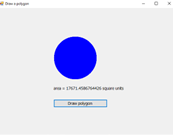
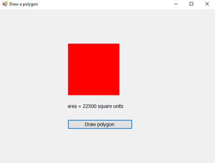
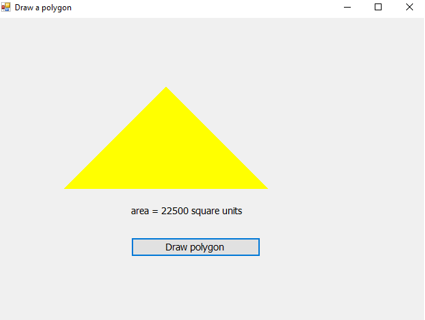
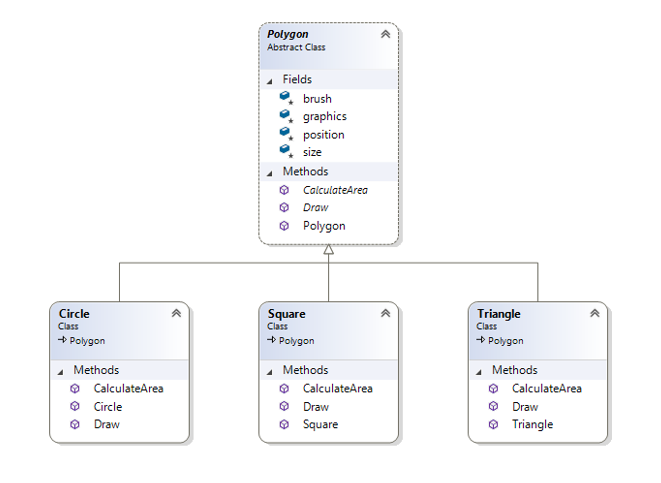

# 09: More Graphics Class

No new material...just more practice.

# Formative Assessment

Before you start, create a new **C# Console** application called **09-formative-assessment**.

If you get stuck on any of the following tasks, feel free to use **ChatGPT** permitting, you are aware of the following:

- If you provide **ChatGPT** with a prompt that is not refined enough, it may generate a not-so-useful response
- Do not trust **ChatGPT's** responses blindly. You must still use your judgement and may need to do additional research to determine if the response is correct
- Acknowledge that you are using **ChatGPT**. In the **README.md** file, please include what prompt(s) you provided to **ChatGPT** and how you used the response(s) to help you with your work

## Task 1:

In the `Molecule` class, create a new `public void` method called `Move`. In the `Move` method, you will need to:
1. Randomly generate an integer value between -10 (inclusive) and 11 (exclusive) using the `Random` class's `Next` method.
2. Get the `Molecule's` X and Y position and add the random integer value using the addition assignment operator (`+=`).

In the `Controller` class, call the `Molecule's` `Move` method in the `Run` method.

## Task 2:
In this task, you will create a bouncing ball. Feel free to create a project. You will need to create a `Ball` class and a `Controller` class. 

The `Ball` class will need to have the following fields:
- A `private` `const` `int` field called `SIZE` that is set to `25`
- A `private` `Point` field called `speed`
- A `private` `Point` field called `position`
- A `private` `Color` field called `colour`
- A `private` `Graphics` field called `graphics`
- A `private` `Brush` field called `brush`
- A private `Size` field called `clientSize`

The `Ball` class will need to have a constructor that takes in a `Point` called `position`, a `Point` called `speed`, a `Color` called `colour`, a `Graphics` called `graphics`, and a `Size` called `clientSize`. Also, you will need to create a new `SolidBrush` object and assign it to the `brush` field. For example:

```cs
public Ball(Point speed, Point position, Color colour, Graphics graphics, Size clientSize)
{
    this.speed = speed;
    this.position = position;
    this.colour = colour;
    this.graphics = graphics;
    this.clientSize = clientSize;
    brush = new SolidBrush(colour);
}
```

The `Ball` class will have three other methods:
- A `public void` method called `Draw` that takes in no parameters. In the `Draw` method, you will need to call the `FillEllipse` method on the `graphics` field and pass in the `brush` object and a new `Rectangle` object that takes in the `position.X`, `position.Y`, `SIZE`, and `SIZE` fields.
- A `public void` method called `Move` that takes in no parameters. In the `Move` method, you will need to set the `position.X` property to the `position.X` property plus the `speed.X` property. You will also need to set the `position.Y` property to the `position.Y` property plus the `speed.Y` property.
- A `public void` method called `BounceSide` that takes in no parameters. In the `BounceSide` method, you will need to check if the `position.X` property is less than 0 or greater than the `clientSize.Width` property. If it is, you will need to set the `speed.X` property to the negative of the `speed.X` property. You will also need to do something similar for the `position.Y` property.

The `Controller` class will need to have the following field: a `private` `Ball` field called `ball`.

The `Controller` class will need to have a constructor that takes in a `Graphics` called `graphics`, and a `Size` called `clientSize`. In the constructor, you will need to create a new `Ball` object and assign it to the `ball` field. For example:

```cs
ball = new Ball(new Point(10, 10), new Point(100, 100), Color.Black, graphics, clientSize);
```

The `Controller` class will have one other methods:
- A `public void` method called `Run` that takes in no parameters. In the `Run` method, you will need to call the `Move`, `BounceSide` and `Draw` methods on the `ball` field. For example:

```cs
public void Run()
{
    ball.Move();
    ball.Draw();
    ball.BounceSide();
}
```

In the `Form1` class, call the `Controller's` `Run` method in the `timer1_Tick` method.	

## Task 3:

When you run the application, you will notice the ball is flickering. In this task, you will implement double buffering. 

What is double buffering? Double buffering is a technique that involves drawing to an off-screen buffer and then copying the off-screen buffer to the screen. This technique is used to prevent flickering.

In the `Form1` class, you will need to create two new fields: a `private` `Bitmap` field called `offScreenBitmap` and a `private` `Graphics` field called `offScreenGraphics`.

In the `Form1` constructor, replace the existing code with the following:

```cs	
public Form1()
{
    InitializeComponent();

    offScreenBitmap = new Bitmap(Width, Height); // An image used as a buffer for rendering
    offScreenGraphics = Graphics.FromImage(offScreenBitmap); // Enables you to draw on the offScreenBitmap
    graphics = CreateGraphics(); // Used to rendering the form
    controller = new Controller(offScreenGraphics, ClientSize);     
    timer1.Enabled = true;
}
```

In the `timer1_Tick` method, replace the existing code with the following:

```cs
private void timer1_Tick(object sender, EventArgs e)
{
    // Clears the buffer by filling the entire image with a black rectangle. This prevents the previous frame from being displayed
    offScreenGraphics.FillRectangle(Brushes.Black, 0, 0, Width, Height);
    controller.Run();
    graphics.DrawImage(offScreenBitmap, 0, 0); // Eliminates flickering and ensures the frame is displayed without partial updates
}
```

Buffer graphics refers to a technique where drawing operations are performed off-screen on a buffer, i.e., image before being displayed on the screen. This approach is often used to reduce flickering and improve rendering performance in graphical applications.

## Task 4:

In this exercise, when the user clicks on a button, a circle, square or triangle is drawn and its area is calculated. The choice of shape is randomly selected on each `button1_Click()` event.







My UML class diagram is:



1. Set up the `Form1` with a `Button` and a `Label`. 

2. Define a base class `Polygon`. Since we will never create an instance of this base class, we declare the class as `abstract`.

```cs
public abstract class Polygon
```

3. `Polygon`s should know their X and Y positions (these are the upper left corners of the square and circle’s bounding rectangle; they are the coordinates of the apex of the triangle, their size and their colour. They need a constructor so that polygon objects can be created. They should also have a `Draw()` method, and a `CalculateArea()` method. In this example, the `Draw()` and `CalculateArea()` methods will always be overridden by the subclasses of `Polygon`. We won’t ever use the base class version of `Draw()` or `CalculateArea()`, so these methods are declared as abstract. 

```cs
public abstract void Draw();
```

**Note:** If the methods could be used by the base class as well as the subclass, the keyword would be `virtual` rather than `abstract`. 

4. Descend three classes from `Polygon`: `Square`, `Circle` and `Triangle`. These descendants have no new fields, properties or methods, they simply declare their overrides of `Draw()` and `CalculateArea()`. For example:

```cs
public override void Draw()
```

5. Write the code for the base class and its subclasses. You can draw the `Triangle` using the `graphics` `DrawPolygon()` method, which accepts an array of `Points`, and "connects the dots". 
		
```cs
graphics.DrawPolygon(pen, new Point[] { position, new Point(position.X + size, position.Y + size), new Point(position.X - size, position.Y + size) });
```

Similarly you can colour in the `Triangle` using the `graphics` `FillPolygon()` method, which accepts an array of `Points`, and "connects the dots". 

```cs
graphics.FillPolygon(brush, new Point[] { position, new Point(position.X + size, position.Y + size), new Point(position.X - size, position.Y + size) });
```

6. Create a `Controller` class that has a field called polygon of type Polygon:

```cs
private Polygon? polygon;
```

Note, you can declare a polygon of type `Polygon`, and then instantiate it as any of `Polygon's` subclasses by calling the correct constructor. Make a `CreatePolygon()` method that randomly creates either a `Square`, a `Triangle` or a `Circle`: 
    
```cs
public void CreatePolygon()
{
    int randomNumber = random.Next(3);
    switch (randomNumber)
    {
    case 0:
        polygon = new Circle(new Point(200, 100), 150, Color.Blue, graphics);
        break;
    case 1:
        polygon = new Square(new Point(200, 100), 150, Color.Red, graphics);
        break;
    case 2:
        polygon = new Triangle(new Point(250, 100), 150, Color.Yellow, graphics);
        break;
    default:
        polygon = null;
        break;
    }
} 
```

Write a method that tells the chosen polygon to draw itself on the form.

Write a method that tells the polygon to calculate its area and return this value to the form where it will be displayed in the label.

7.	Write a `button1_Click` handler for the button so that when it is clicked, it calls the `Controller's` `CreatePolygon()`, `DrawPolygon()`, `CalculatePolygonArea()` methods for the newly created polygon.  

## Task 5:

Once you have declared a class structure like `Polygon`, you can use it in any application where it might be needed. We will build a screen saver that fills the screen with a random assortment of squares, circles and triangles of different sizes and colours. This is my computer screen after the application has been running for about a minute:

To build this application:


1. You need a `Timer` that, on each tick, generates some Polygons in assorted colours, sizes and locations. In my solution, in the `Controller`, I generate one `Circle`, one `Square` and one `Triangle` at each timer interval. To generate a nice variety of colours, remember that type `Color` is not restricted to values of `Color.Blue`, `Color.Red`, etc., but the red, green and blue elements can each be any integer between 0 and the number of colours your screen can display, usually 256. Create your `Polygons` with their `color` property set to 

```cs
Color.FromArgb(random.Next(256), random.Next(256), random.Next(256));
```

2.	When we create a large number of objects and draw them to the screen, we will be consuming a large amount of RAM. To conserve our resources, after we have drawn an object, we should then destroy it, by writing:

```cs
polygon = null;
```

3. You need to set the `Form` size equal to the screen size, by setting it’s `WindowState` to `Maximized` in the Properties window.

4. To make the `Form` invisible, so that the window behind shows through:

- Check that the `Opacity` is set to `100%`.
- Select a colour value for the `Form's` `TransparencyKey` from the drop down box. Choose any colour you like. This means that you will be nominating a colour such that any pixels in that colour will be invisible.
- Set the `Form's` `BackColor` property (still in the Properties window) to whatever you selected as the `TransparencyKey`. This will cause all the pixels of the `Form` to be invisible; only the window bar at the top of the `Form` will show.

5. Experiment with the parameters of your application until you get a performance you like. Then modify your `timer1_Tick()` handler so that after some number of ticks (enough to let the screen get pretty full), it clears the screen and starts again.

6. One of the advantages of the Object-Oriented approach is that the resulting code is easily extensible. Satisfy yourself of this by extending your screensaver to also draw hexagons and pentagons. 
Did you have to modify your `Timer` handler? If so, how might you have written it so that no modification would be required?

# Formative Assessment Submission

Push your code to your **GitHub** repository.
