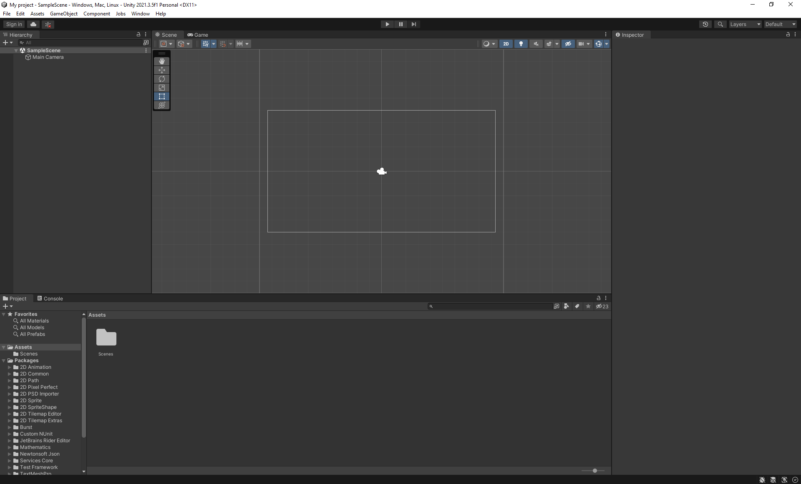
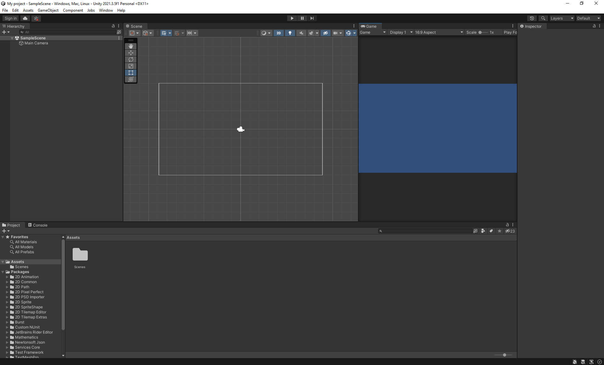
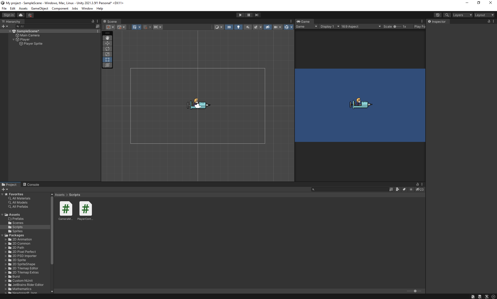
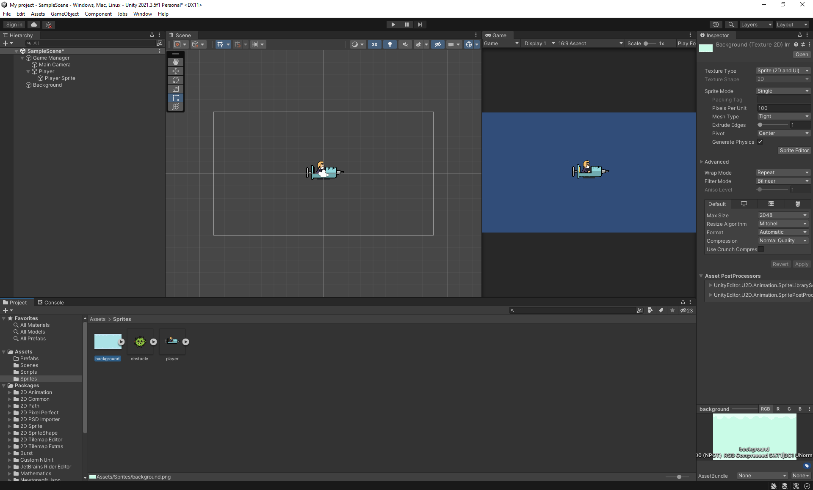
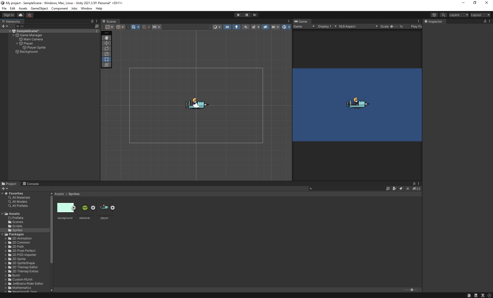
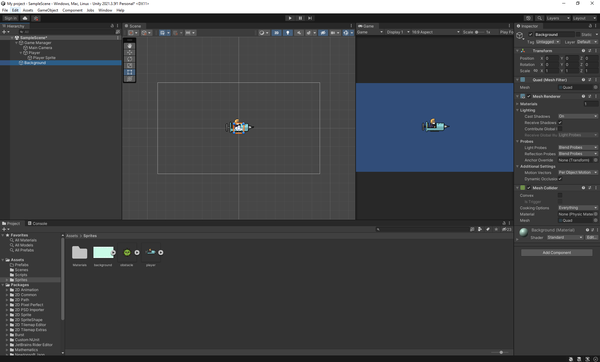
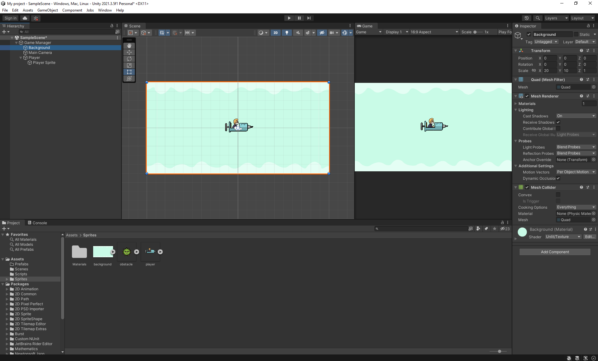
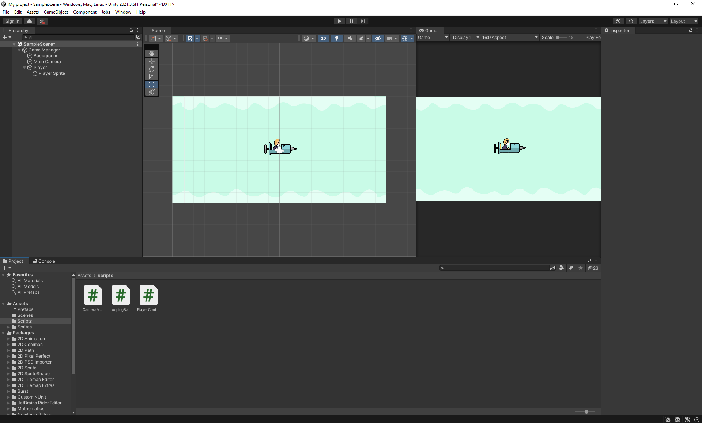

# Unity

## Overview

## Project Creation

Open **Unity Hub**. You will be presented with the following:


Currently, you have no projects. To create a new project, click on the **New project** button.

There are a variety of templates to choose from, i.e., 2D and 3D. Choose the **2D** template. In the **Project Settings**, you can set the project's name and location. Set the project's location to your **Class Tasks** repository path. Click on the **Create project** button.


## Project Configuration

In might take about a minute or so to create a new project. Once the project is created, you will be presented with the following:



At first, it might be overwhelming. Do not worry, you will become somewhat familiar with the environment as you progress through the lecture notes. 

In the **Hierarchy** window displays every **GameObject** in a **Scene**. For example, **Main Camera**. You can use the **Hierarchy** window to add, remove, sort and group **GameObjects** in a **Scene**.

**Resource:** <https://docs.unity3d.com/Manual/Hierarchy>



In the **Assets** window, create three new folders - `Prefabs`, `Scripts` and `Sprites`. To do so, right-click on the **Assets window > Create > Folder**. You will notice that each folder excluding `Scenes` are not solid grey. It indicates that these folders are empty.


## Asset Creation

In the `lecture-notes` directory, you will find a directory called `13-unity-1`. This directory contains three assets - `background.png`, `obstacle.png` and `player.png`. Drag and drop these assets into the `Sprites` directory.


## Player Controller

Drag and drop the `player` asset into the **Hierarchy** window. Rename the `player` asset (in the **Hierarchy** window) to `Player Sprite`. 


Create a new **GameObject** called `Player`. A **GameObject** is a base class for all entities, i.e., `Player Sprite` in a **Scene**. 

**Resource:** <https://docs.unity3d.com/ScriptReference/GameObject>


Drag and drop the `Player Sprite` into the `Player` **GameObject**. `Player Sprite` is a descendent or child of `Player` **GameObject**.


Click on the `Player` **GameObject**. In the **Inspector** window, click on the **Add component** button. Search for **Rigidbody 2D** and press <kbd>Enter</kbd>. **Rigidbody 2D** places an object under the control of the physics engine, i.e., allow the `Player` **GameObject** to move. Set the **Scale X and Y** to 0.5, **Gravity scale** to zero (0) to ensure the `Player` **GameObject** stays in the air and **Constraints > Freeze Rotation** to checked to prevent the `Player` **GameObject** from rotating/spinning on the Z axis.

**Note:** a **GameObject** can only have one **Rigidbody 2D** component.

**Resources:** 

- <https://docs.unity3d.com/Manual/UsingTheInspector>
- <https://docs.unity3d.com/Manual/class-Rigidbody2D>


In the `Scripts` directory, create a new **C# Script**. To do so, right-click on the **Assets window/Scripts > Create > C# Script**. Name the **C# Script**, `PlayerController.cs`.

Open the `PlayerController.cs` **C# Script** in **Visual Studio Code**. Add the following code:


Open the Please read the comments in the code snippet below:

```cs
using System.Collections;
using System.Collections.Generic;
using UnityEngine;

// PlayerController implements the MonoBehaviour interface.
// The MonoBehaviour interface's members which PlayerController must implement are Start() and Update()
public class PlayerController : MonoBehaviour
{
    // Public field which you can set its value in the Player GameObject's inspector window
    public float speed;

    private Rigidbody2D rb;
    private Vector2 direction;

    // Start is called before the first frame update
    void Start()
    {
        // Getting the component of type Rigidbody2D
        rb = GetComponent<Rigidbody2D>();
    }

    // Update is called once per frame
    void Update()
    {
        // Get the value of the virtual axis identified by "Horizontal" or "Vertical"
        // Resource: https://docs.unity3d.com/ScriptReference/Input.GetAxisRaw
        float directionY = Input.GetAxisRaw("Vertical");
        direction = new Vector2(0, directionY).normalized;
    }

    void FixedUpdate()
    {
        // The Rigidbody's velocity is specified as a vector with components in 
        // the X and Y directions. This allows the Player GameObject to move
        // in the Y direction direction at a given speed

        rb.velocity = new Vector2(0, direction.y * speed);
    }
}
```

Save the `PlayerController.cs` file and return to the **Unity Editor**.

Drag and drop `PlayerController.cs` **C# Script** into the **Inspector** window. Set the `speed` to 10.


Test the changes by clicking on the **Play** button. Move the `Player` **GameObject** by using the <kbd>↑</kbd> and <kbd>↓</kbd> arrows.


## Camera Movement

In the `Scripts` directory, create a new **C# Script**. To do so, right-click on the **Assets window/Scripts > Create > C# Script**. Name the **C# Script**, `CameraMovement.cs`.

Open the `CameraMovement.cs` **C# Script** in **Visual Studio Code**. Add the following code:

```cs
using System.Collections;
using System.Collections.Generic;
using UnityEngine;

public class CameraMovement : MonoBehaviour
{
    public float speed;

    // You can remove the Start() method

    // Update is called once per frame
    void Update()
    {
        // This will be used to move the camera on the X axis
        transform.position += new Vector3(speed * Time.deltaTime, 0, 0);
    }
}
```



Create a new **GameObject** called `Game Manager`.


<!--  -->

Drag and drop the `Main Camera` and `Player` **GameObjects** into the `Game Manager` **GameObject**. 



Create a new **Quad** called `Background`. To do so, right-click on the **Hierarchy window > 3D Object > Quad**. 



In the **Assets** window, click on the `background` asset and set the **Wrap Mode** to **Repeat**.








```cs
using System.Collections;
using System.Collections.Generic;
using UnityEngine;

public class LoopingBackground : MonoBehaviour
{
    public float speed;
    public Renderer renderer;

    // Start is called before the first frame update
    void Start()
    {
       
    }

    // Update is called once per frame
    void Update()
    {
        renderer.material.mainTextureOffset += new Vector2(speed * Time.deltaTime, 0);
    }
}
```


