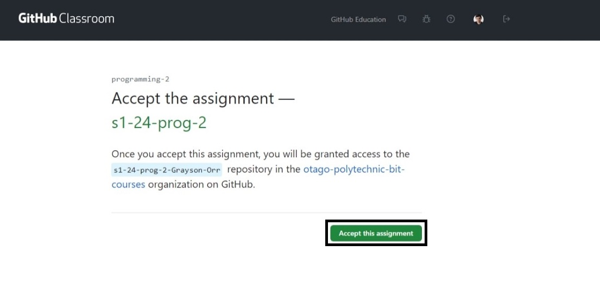
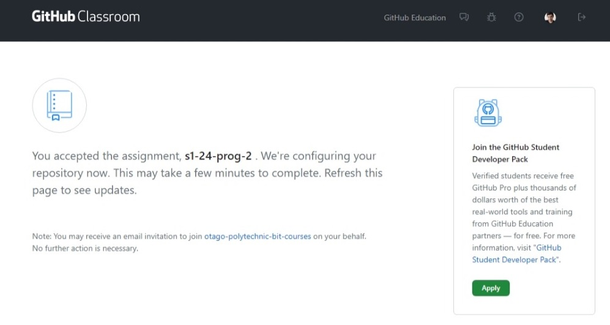
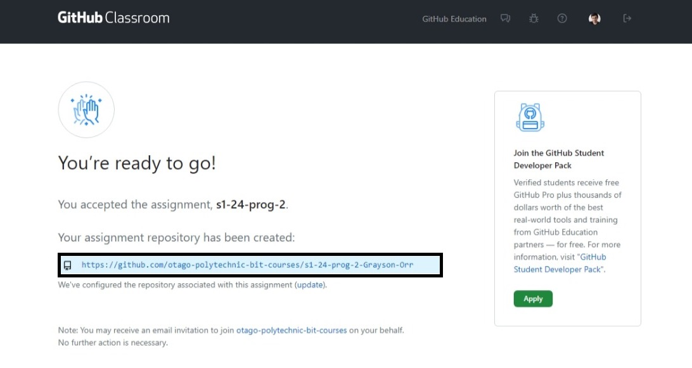
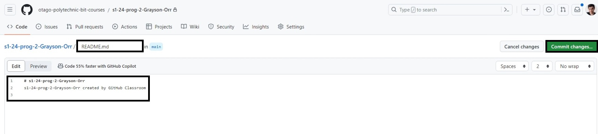
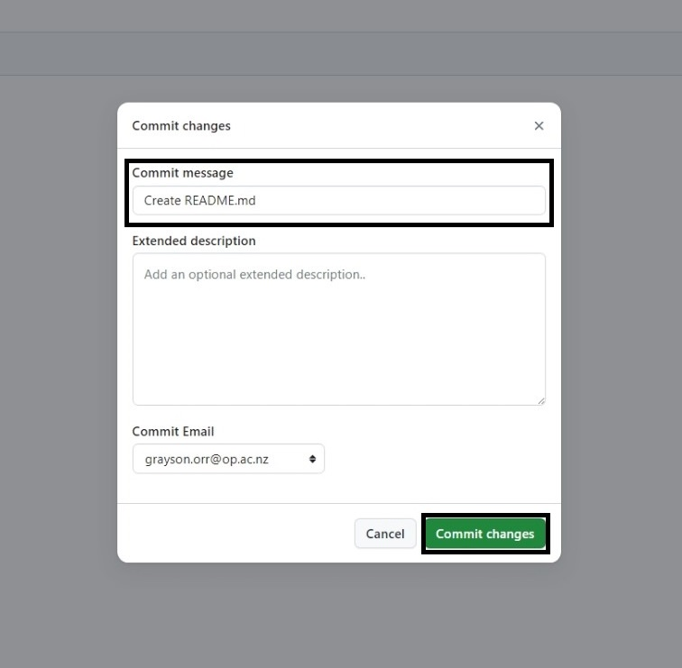
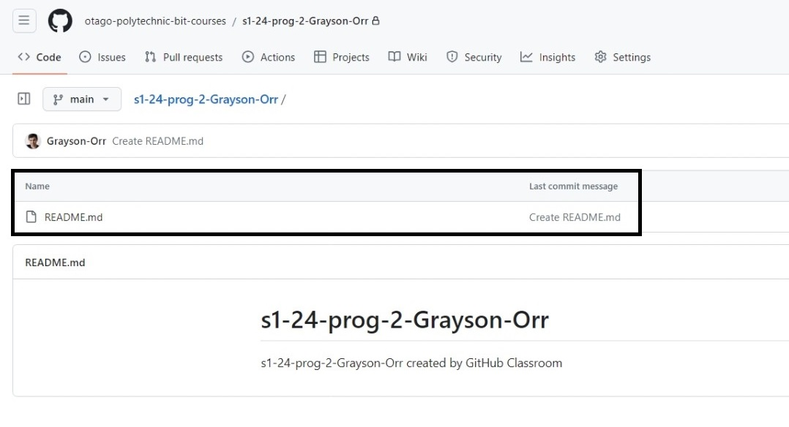
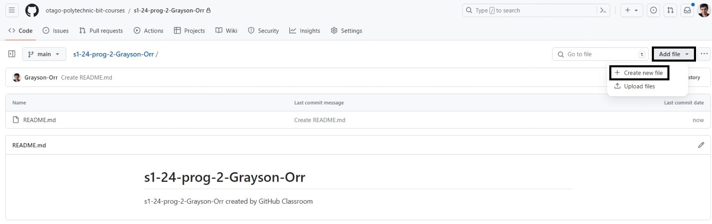
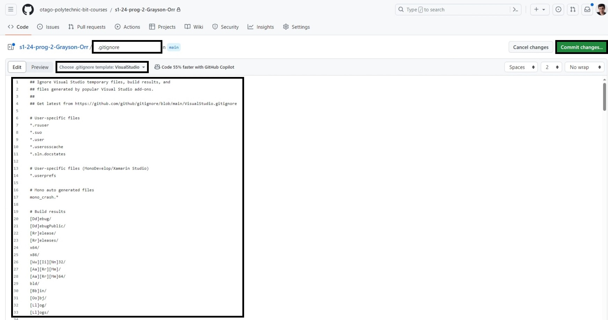
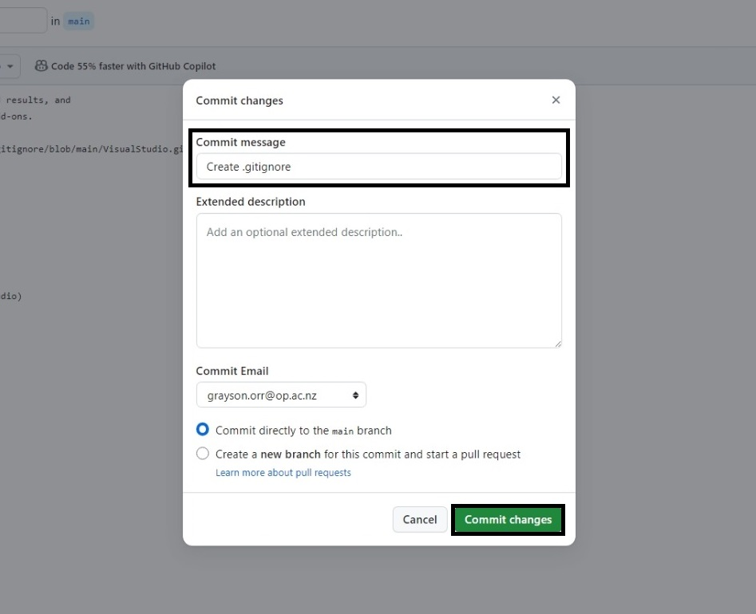
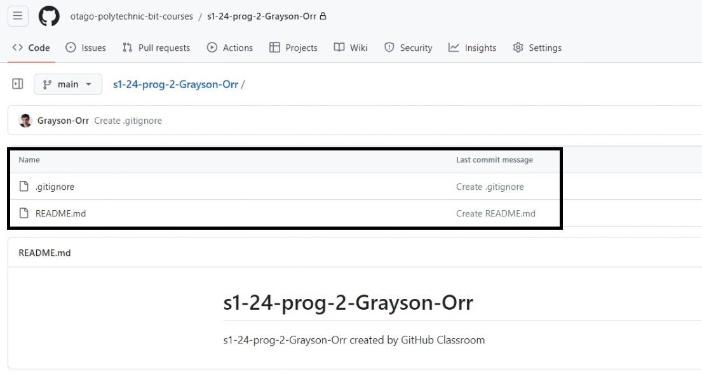

# Glossary

- **Git**: A version control system that allows multiple developers to work on the same project. It is a distributed version control system, meaning the entire codebase and its history are available on every developer's computer.
- **GitHub**: A web-based platform used for version control and collaboration on software development projects.
- **GitHub Classroom**: A tool that allows teachers to create and manage assignments using GitHub repositories. It allows teachers to create student repositories, distribute starter code, collect assignments, and provide feedback to students.
- **Repository**: A repository is a storage location where your project's files are stored. It can be local to a directory on your computer or a storage location on GitHub.
- **Commit**: A commit is a snapshot of your repository at a specific point in time. It is a record of what changes you have made to your repository.
- **README**: A README file is a text file that contains information about your project. It is usually the first file people see when visiting your repository on GitHub.
- **.gitignore**: A .gitignore file is a text file that tells Git which files or folders to ignore in your project. It is useful for excluding files generated by your development environment, such as log files, build artifacts and temporary files.

# Github Setup

1. The course lecturer will provide a **GitHub Classroom** link. Click on the link. You should see a green **Accept the assignment** button. Click on it.

 

2. GitHub will be configuring your repository. After 10 seconds, refresh the page. 

 

3. You should see a link to your repository. Click on it.

4. Click the **README** link to create your first commit.

 

5. The name of the file is `README.md`. Feel free to edit the contents of the file. Click the green **Commit changes...** button.

 

6. Feel free to edit the commit message. Click the green **Commit changes...** button.

 

7. You see the `README.md` file. You have successfully created your first commit.

 

8. To add a `.gitignore` file, click the **Add file** button and select **Create new file**.

 

9. Unlike the `README.md` file, the name of the file is empty. Type in `.gitignore`. You should see a dropdown menu appear. Click on it and select the appropriate `.gitignore` template. Click the green **Commit changes...** button.

 

10. Feel free to edit the commit message. Click the green **Commit changes...** button.

 

11. You see the `.gitignore` file. You have successfully created your second commit.

# Git Integration in Visual Studio

